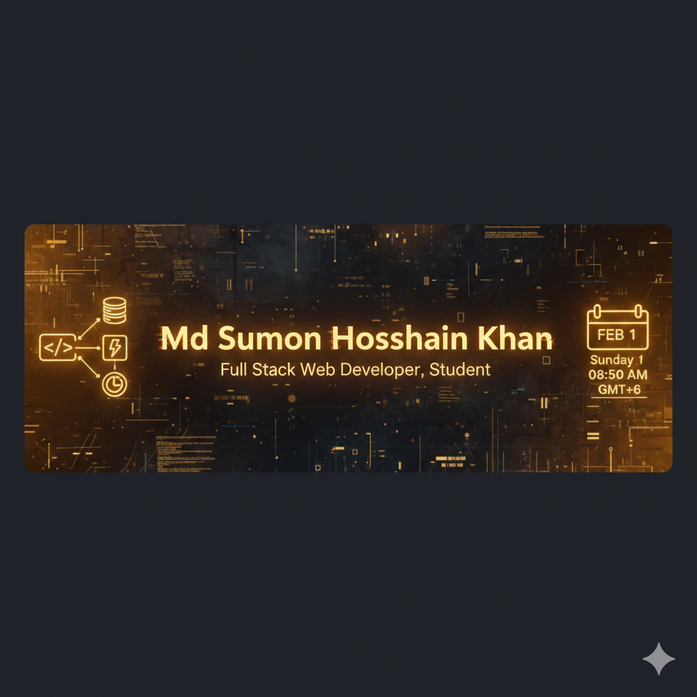

# Hi there, I'm Md Sumon Hossain Khan 👋
### Full Stack Web Developer | Passionate Student

---

### 💫 About Me:
I am a dedicated **Full Stack Web Developer** from Bangladesh, constantly learning new technologies and building impactful projects.

---

### 🛠 Tech Stack:

  

---

### 📊 GitHub Stats:

---

  

