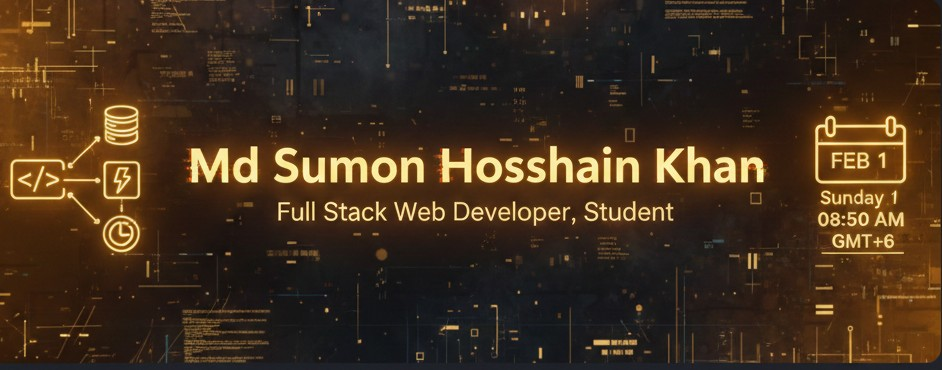

# 💫 Md Sumon Hossain Khan 
### 🚀 Full Stack Web Developer | Dedicated Student

---

### 🤝 Connect with Me

---

### 🛠 My Professional Tech Stack

| 🌐 Frontend | 🖥 Backend & DB | 🔧 Tools & Others |
| :--- | :--- | :--- |
|  |  |  |

---

### 📊 GitHub Analysis

  
  

  

---

### 🐍 Contribution Activity

  

  

